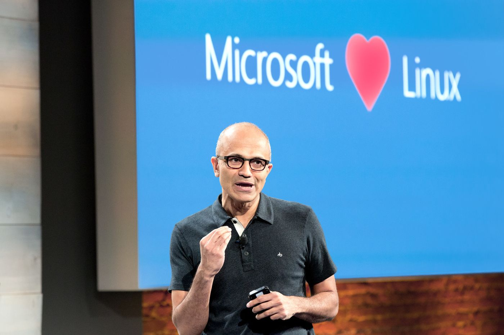
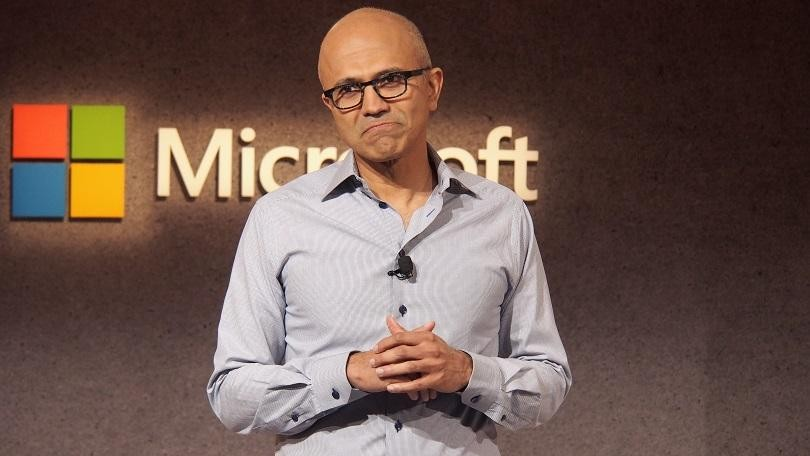

## Would you run production on Docker?

 
www.TheDatabaseAvenger.com
 
@DatabaseAvenger
 
James@TheSQLPeople.com

---

## Agenda

* Microsoft is changing
* Is SQL Server on Docker a good idea?
* Production Requirements
* Is anyone doing it?
* How would I do it?
* What's stopping us?

---

## James Anderson

* 2008 - IT Support 
 

* 2010 - Windows Sys Admin
 

* 2012 - SQL Server DBA
 

* 2017 - Data Engineer
 

* Side projects: Machine Learning, Python...

---

---

---

---

---

---

---

---

---

---

## Microsoft Loves Docker

  4 years ago MS announced a partnership with Docker<!-- .element: class="fragment" -->

  Windows Server 2016 brings Windows Containers<!-- .element: class="fragment" -->

  SQL Server 2017 on Linux<!-- .element: class="fragment" -->

  MS & Docker announce Cloud Native Application Bundle<!-- .element: class="fragment" -->

---

## Containers in a Nutshell

* Isolation<!-- .element: class="fragment" -->
* Just a process<!-- .element: class="fragment" -->
* The host's kernel matters<!-- .element: class="fragment" -->
* Fast boot<!-- .element: class="fragment" -->
* Declaritive<!-- .element: class="fragment" -->
* Images<!-- .element: class="fragment" -->
* Oh, and they don't save your data!<!-- .element: class="fragment" -->

---

## Stateful systems in ephemeral containers?

---

## SQL Server on Docker

---

## Yes, it's good for dev and test

Isolation<!-- .element: class="fragment" -->

Dynamic Test Environments!<!-- .element: class="fragment" -->

---

## Why would we use Docker in Production?

* Environment maintenance<!-- .element: class="fragment" -->
* Reduced patching<!-- .element: class="fragment" -->
* One tool to rule them all<!-- .element: class="fragment" -->
* Easier HA<!-- .element: class="fragment" -->
* Horizontal scaling for read-only data<!-- .element: class="fragment" -->

---

## Production Requirements

* Data persistance
* Security
* High Availability
* Disaster Recovery
* Licensing
* Monitoring
* Patching

---

## Sounds like we need more than vanilla Docker

---

## Orchestration

* Kubernetes
* OpenShift
* Swarm
* Cloud Container Services

---

## Custom Images

  Required Features Enabled<!-- .element: class="fragment" -->

  Antivirus<!-- .element: class="fragment" --> 

  Monitoring agents<!-- .element: class="fragment" -->

  Maintenance Tools<!-- .element: class="fragment" -->

---

## Is Anyone Doing This?

---

## How Would I Do It?

How is the open source world doing it?<!-- .element: class="fragment" -->

KubeDB<!-- .element: class="fragment" -->

Postgres and Crunchy Data<!-- .element: class="fragment" -->

---

---

## How Would I Like To Do It?

Cloud container service<!-- .element: class="fragment" -->

Or<!-- .element: class="fragment" -->

OpenShift + clustered storage<!-- .element: class="fragment" -->
 

Windows containers<!-- .element: class="fragment" -->
 

---

## Production Ready?

* Data persistance
* Security
* High Availability
* Disaster Recovery
* Licensing
* Monitoring
* Patching

---

## Would I do this?

---

## No

---

## What's Stopping Us?

* SQL Server is a monolith<!-- .element: class="fragment" -->
* Tooling<!-- .element: class="fragment" -->
* Older versions of SQL Server<!-- .element: class="fragment" -->
* Is the app running in Docker?<!-- .element: class="fragment" -->
* Licensing<!-- .element: class="fragment" -->
* Skilled staff<!-- .element: class="fragment" -->

---

## Old School Microsoft

---

> "Linux is not in the public domain. Linux is a cancer that attaches itself in an intellectual property sense to everything it touches. That's the way that the license works."

---

Thanks for listening
 
 
Any questions?
 
 
www.TheDatabaseAvenger.com
 
@DatabaseAvenger
 
James@TheSQLPeople.com
