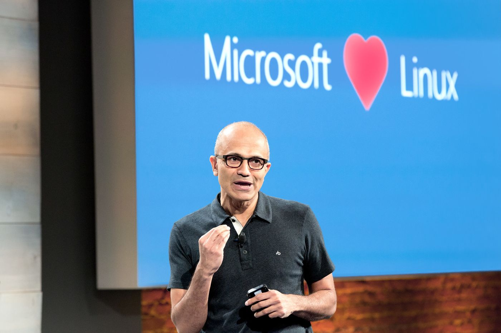

## Would you run production on Docker?

 
www.TheDatabaseAvenger.com
 
@DatabaseAvenger
 
James@TheSQLPeople.com

---

## Agenda

Is this a good idea?

  What do we need?

  How would I do it?

  Is anyone doing it?

  What's stopping us?

---

## Me

  James Anderson

  Windows sysadmin

  SQL Server DBA

  Small use of Linux

---

---

---

---

---

## Microsoft Loves Docker

  Roughly 3 years ago MS announced a partnership with Docker<!-- .element: class="fragment" -->

  Windows Server 2016 brings Windows Containers<!-- .element: class="fragment" -->

  SQL Server on Linux<!-- .element: class="fragment" -->

---

## SQL Server on Docker

<!-- .element: class="fragment" -->

---

## Stateful systems in ephemeral containers?

---

## Yes, it's good for dev and test

Dynamic Environments<!-- .element: class="fragment" -->

 Platform Agnostic<!-- .element: class="fragment" -->

 Concurrent tests on all supported platforms<!-- .element: class="fragment" -->

 Package Depdencies<!-- .element: class="fragment" -->

---

## Why would we use Docker in Production?

  Test environments are uptodate

  Reduced patching

  Easier HA / DR setup

  Horizontal scaling for read-only data

---

## Production ready

* Data persistance
* Security
* High Availability
* Disaster Recovery
* Licensing
* Monitoring
* Deploying SQL Server updates

---

## Sounds like we need more than vanilla Docker

---

## Orchestration

* Swarm
* Mesosphere
* OpenShift
* Kubernetes
* Cloud Container Services 

---

## Custom Images

  Required Features Enabled

  Latest Cumalitive Updates Applied

  Maintenance Tools Installed

---

## How Would I Do It?

I'd look to see how the open source world is doing it<!-- .element: class="fragment" -->

Postgres and Crunchy Data<!-- .element: class="fragment" -->

<!-- .element: class="fragment" -->

---

---

## So, How Would I Do It?

* Cloud Container Service
	* OpenShift + clustered storage 

 
* Windows Container

 	
* Helm

---

## Is Anyone Doing This?

* dv01

 
* I asked in a few places
	* Twitter
	* Hacker News
	* Reddit

---

## What's Stopping Us?

* Older versions of SQL Server
* Is the app running in Docker?
* Nextgen VMs
* Licensing
* Skilled staff

---

## One last one from the big man

---

> "Linux is not in the public domain. Linux is a cancer that attaches itself in an intellectual property sense to everything it touches. That's the way that the license works."

---

Thanks for listening
 
 
Any questions?
 
 
www.TheDatabaseAvenger.com
 
@DatabaseAvenger
 
James@TheSQLPeople.com
